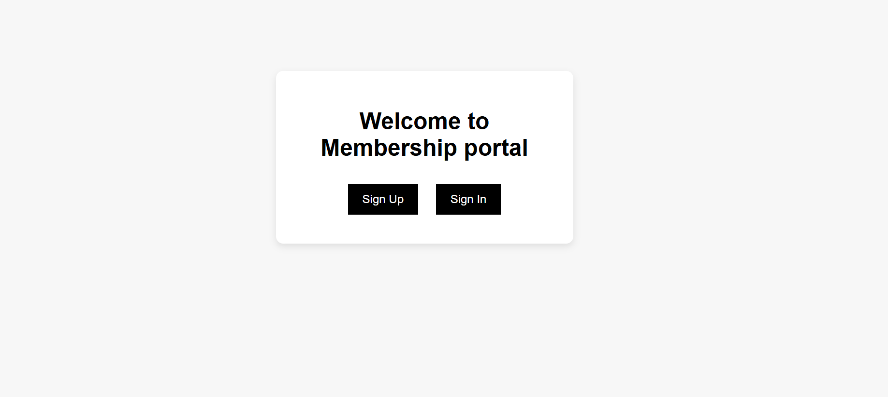
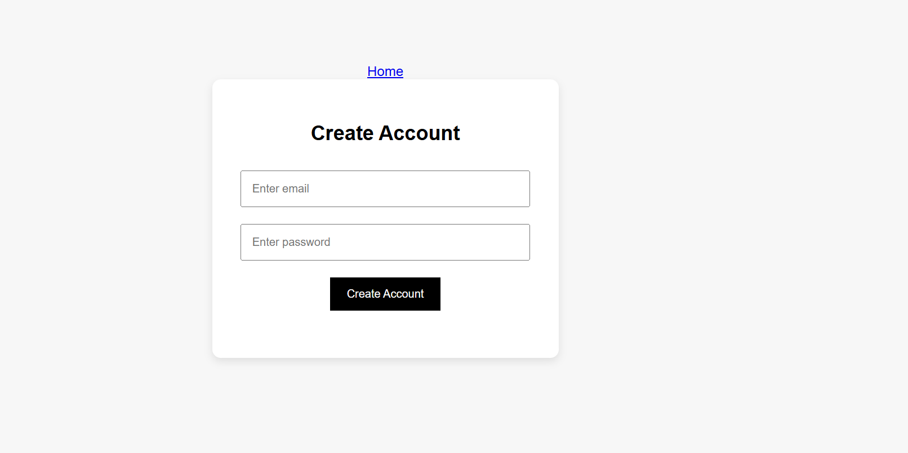
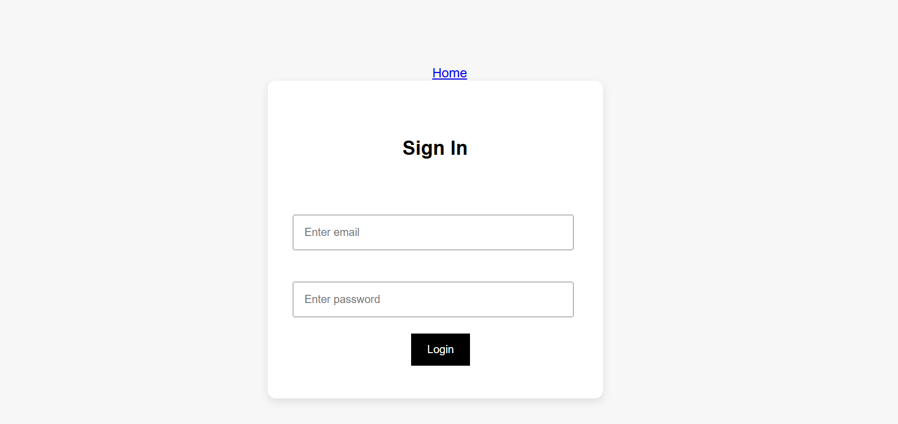
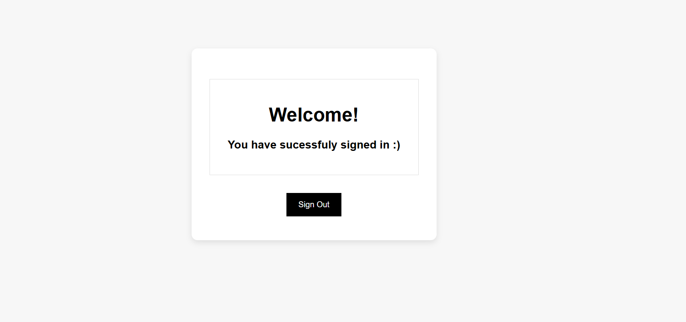

# Frontend-Authentication-UI
A multi-page authentication interface simulating user registration and login functionality
## Overview
This project demonstrates a basic authentication flow using browswer localStorage without a backend.

## Features
- Sign up and sign in pages
- Email format validatio
- User session simuation using localStorage
- profile/dashboard page
- Sign out functionality

## Technologies Used 
- HTML
- CSS3
- JavaScript
- LocalStorage API

## Screenshots

## Future Improvements
- Backend authentication
- Password encryption
- Session management
- Database integration
- Error handling

